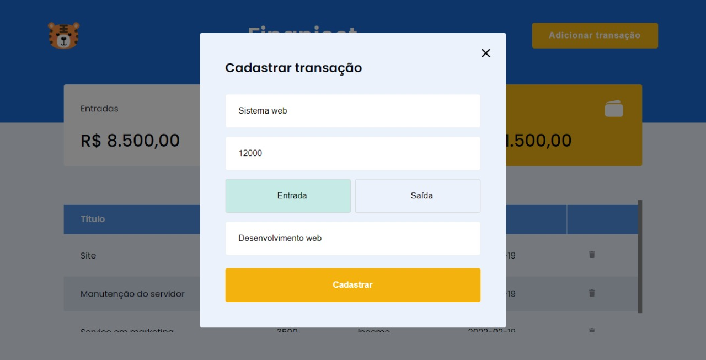

# Finanject

## Demonstration

## Aprendizado

- Projeto focado no aprendizado básico do ReactJS, consumindo uma API para fornecer e manipular os dados.

## Teachs and libs

- [] ReactJS
- [] Typescript
- [] Styled Components
- [] Vite
- [] React-modal
- [] Axios

## LINK

- https://josmar-jr.github.io/Spiderman/

## Author

**Josmar Junior**

Encontre-me nas redes sociais como @josmar_jr
